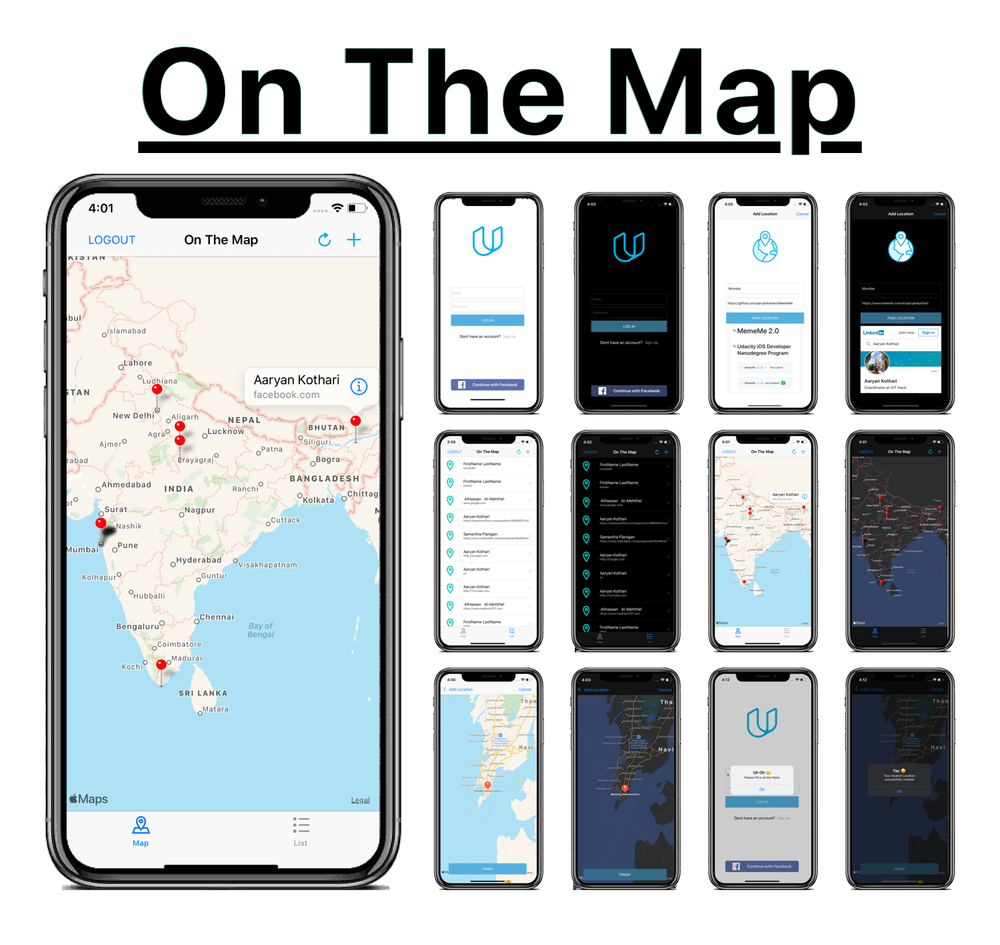

# On-The-Map
## Udacity iOS Developer Nanodegree Program


```Swift
- On The Map Project
```

```Swift
- This app shows information posted by other students on a map.
```

 ## Screenshots
 <p float="left">
       
 </p>


## Credits
Original graphical assets were provided by Udacity.
The concept for this app was presented during the iOS Nanodegree programme provided by Udacity.
